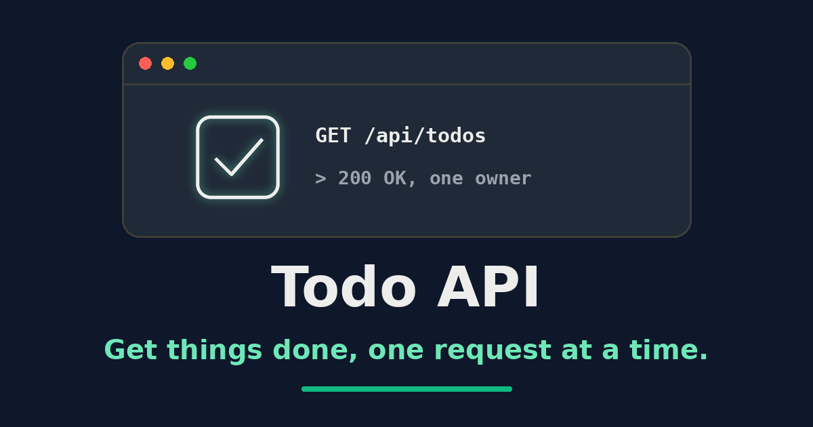

# Todo API

[](phpunit.xml)
[](LICENSE.md)
[](composer.json)
[](https://www.php.net/)
[](https://laravel.com/)

> Get things done, one request at a time.

A token-authenticated Laravel REST API for managing personal todo items. Todo API is a compact reference implementation of a layered Laravel service: resource controllers, a service and repository layer, API resources, Sanctum tokens, and per-user data scoping.



## Table of Contents

- [Features](#features)
- [Tech Stack](#tech-stack)
- [Install](#install)
  - [Requirements](#requirements)
  - [Local Setup](#local-setup)
- [Usage](#usage)
- [API](#api)
  - [Endpoints](#endpoints)
  - [Todo Fields](#todo-fields)
  - [Examples](#examples)
- [Postman Collection](#postman-collection)
- [API Documentation](#api-documentation)
- [Testing](#testing)
  - [Pre-commit Hook](#pre-commit-hook)
- [Open Graph Image](#open-graph-image)
- [Contributing](#contributing)
- [License](#license)

---

## Features

- **Token authentication:** Exchange credentials for a Laravel Sanctum personal access token and call protected endpoints with a bearer header.
- **Todo resource:** Create, list, read, update, and delete todos through a conventional `apiResource` route set.
- **Per-user scoping:** A `UserScope` global scope constrains every todo query to the authenticated user, so one account never reads another's records.
- **Layered design:** Controllers delegate to services, services delegate to repositories, and only repositories touch Eloquent.
- **Typed domain errors:** Dedicated exceptions carry HTTP status codes into the JSON error response instead of leaking framework messages.
- **Consistent envelopes:** API resources emit a stable `type` / `id` / `attributes` shape; the base controller wraps success in `data` and failure in `error`.
- **Soft deletes:** Deleted todos are retained in the database rather than destroyed.
- **Rate limiting:** Global throttling on the API group with a stricter limit on token issuance.
- **Localized messages:** Response strings resolve through translation files for English and Serbian.
- **Generated documentation:** Scramble derives an OpenAPI document straight from the application code.

[⬆ back to top](#table-of-contents)

---

## Tech Stack

- **Backend:** PHP 8.2+ and Laravel 12
- **Authentication:** Laravel Sanctum personal access tokens
- **Database:** SQLite by default; any Laravel-supported driver via `.env`
- **Testing:** PHPUnit with a required minimum coverage of 100%
- **Quality:** Rector, Peck, Laravel Pint, and PHPStan/Larastan
- **Documentation:** Scramble (OpenAPI) and Laravel Boost

[⬆ back to top](#table-of-contents)

---

## Install

### Requirements

- PHP 8.2 or newer with the extensions required by [`composer.json`](composer.json)
- Composer 2
- Node.js 20 or newer with npm, for the Husky pre-commit hook
- Python 3 with [Pillow](https://pypi.org/project/pillow/), only to regenerate the [Open Graph image](#open-graph-image)

### Local Setup

Clone the repository and create the local environment file:

```bash
git clone https://github.com/zlatanstajic/todo-api.git
cd todo-api
cp .env.example .env
```

Configure the database and the default admin account in `.env`, then run:

```bash
composer setup
```

The setup script installs PHP and Node.js dependencies, creates the SQLite database file, generates the application key, recreates and seeds the database, refreshes the IDE helper files, and runs the complete quality suite. Because it runs `migrate:fresh`, it deletes existing data in the configured development database.

The seeders create a default admin account for local development from these `.env` values:

| Variable | Default | Description |
|---|---|---|
| `ADMIN_NAME` | `Admin` | Display name of the seeded admin |
| `ADMIN_EMAIL` | `admin@todo-api.com` | Login email for token requests |
| `ADMIN_PASSWORD` | `secret` | Login password for token requests |

Change these values before using the application in any non-local environment.

[⬆ back to top](#table-of-contents)

---

## Usage

Start the local application, queue listener, and log viewer with:

```bash
composer run serve
```

The application is available at `http://localhost:8000` by default. To start only the HTTP server:

```bash
php artisan serve
```

[⬆ back to top](#table-of-contents)

---

## API

All routes are throttled to 60 requests per minute. Token issuance is throttled to 3 requests per minute. Todo routes require the `auth:sanctum` middleware and operate exclusively on the authenticated user's records.

### Endpoints

| Method | Path | Auth | Description |
|---|---|---|---|
| `GET` | `/api/` | Public | Welcome message |
| `POST` | `/api/tokens` | Public | Exchange `email` and `password` for a bearer token |
| `GET` | `/api/todos` | Bearer | List the authenticated user's todos |
| `POST` | `/api/todos` | Bearer | Create a todo |
| `GET` | `/api/todos/{id}` | Bearer | Read a single todo |
| `PUT`/`PATCH` | `/api/todos/{id}` | Bearer | Update a todo |
| `DELETE` | `/api/todos/{id}` | Bearer | Soft delete a todo |

### Todo Fields

| Field | Type | Notes |
|---|---|---|
| `user_id` | integer | Owner; set from the authenticated user, never from the request body |
| `title` | string | Required on create, `max:255` |
| `description` | string \| null | Optional free text |
| `completed` | boolean | Defaults to `false` |
| `created_at` | datetime | Immutable datetime cast |
| `updated_at` | datetime | Immutable datetime cast |
| `deleted_at` | datetime \| null | Set by the soft delete |

### Examples

Exchange credentials for a token. The credentials come from your environment (`ADMIN_EMAIL` and `ADMIN_PASSWORD`):

```bash
curl -X POST http://localhost:8000/api/tokens \
    -H "Content-Type: application/json" \
    -d '{"email":"admin@todo-api.com","password":"secret"}'
```

Use the returned bearer token to call protected endpoints:

```bash
curl http://localhost:8000/api/todos \
    -H "Authorization: Bearer <token>"
```

Create a todo:

```bash
curl -X POST http://localhost:8000/api/todos \
    -H "Authorization: Bearer <token>" \
    -H "Content-Type: application/json" \
    -d '{"title":"Write the README","completed":false}'
```

[⬆ back to top](#table-of-contents)

---

## Postman Collection

A ready-to-use Postman collection and environment live in the [`postman`](postman) directory.

- **Collection:** [`todo-api.postman_collection.json`](postman/todo-api.postman_collection.json) contains requests for authentication, user info, and every Todo operation.
- **Environment:** [`todo-api-development.postman_environment.json`](postman/todo-api-development.postman_environment.json) is pre-configured with the base API URL and a placeholder for your access token.

[⬆ back to top](#table-of-contents)

---

## API Documentation

The `dedoc/scramble` development dependency generates an OpenAPI document from the application code and serves it on two routes:

- `/docs/api` — interactive documentation viewer
- `/docs/api.json` — the OpenAPI JSON document, usable with any tool that accepts OpenAPI/Swagger

Scramble exposes these routes in the `local` environment only. To reach them elsewhere, configure the `viewApiDocs` gate as described in the [Scramble documentation](https://scramble.dedoc.co/usage/getting-started#docs-authorization).

[⬆ back to top](#table-of-contents)

---

## Testing

Run the complete quality suite:

```bash
composer run test
```

This checks Rector, Peck, Pint, PHPStan, and PHPUnit in that order. PHPUnit enforces 100% coverage, so a new code path without a test fails the suite. Auto-fix what can be fixed with:

```bash
composer run fix
```

During development, run the smallest relevant test first:

```bash
php artisan test --compact tests/Unit/TodoServiceTest.php

# Or filter by test method name
php artisan test --compact --filter=test_name
```

Individual gate steps are available as `composer test:rector`, `composer test:peck`, `composer test:pint`, `composer test:phpstan`, and `composer test:phpunit`.

### Pre-commit Hook

The repository includes a Husky hook at [`.husky/pre-commit`](.husky/pre-commit) that runs `composer run test` before each commit. It is installed by npm's `prepare` script when dependencies are installed. To install or refresh it explicitly, run:

```bash
npm run prepare
```

A failing check aborts the commit. Run `composer run test` directly to reproduce the failure. Bypass the hook for a single commit only when necessary with:

```bash
git commit --no-verify
```

[⬆ back to top](#table-of-contents)

---

## Open Graph Image

The social preview at [`assets/img/og-image.png`](assets/img/og-image.png) is generated, not hand-drawn. Regenerate it after changing the project name or tagline:

```bash
python3 scripts/gen-og-image.py
```

The script requires Pillow and a bold DejaVu or Liberation TrueType font. It contains no randomness and no timestamps, so the same inputs produce a byte-identical PNG on every run; if no suitable font is installed it fails loudly rather than falling back to a low-resolution default.

[⬆ back to top](#table-of-contents)

---

## Contributing

Contributions are welcome. Open an issue to discuss a change, then submit a pull request that keeps `composer run test` green, including the 100% coverage requirement.

[⬆ back to top](#table-of-contents)

---

## License

This project is licensed under the MIT License. See the [LICENSE](LICENSE.md) file for details.

[⬆ back to top](#table-of-contents)
